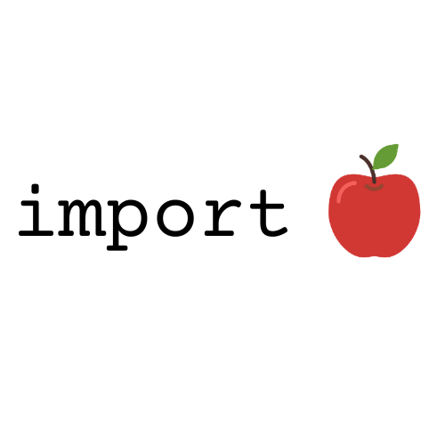

# ilovapples
---
<a href="https://ilovapples.github.io"></img></a>

## Programming Languages
- [Python](https://python.org)
- [JavaScript](https://javascript.com)
- [C++](https://www.isocpp.org) (-ish)

## Web-Dev/Markup Languages
- HTML
- CSS
- [JavaScript](//javascript.com) (?)

(plus I play Minecraft)

## Learning (at some point)
- [Java](https://java.com) (learned it for Minecraft modding)
- [Lua](https://lua.org) (learned it for ComputerCraft)
- [C++](https://www.isocpp.org) (still learning)
- [Go](https://go.dev) (Just started learning it on 4/10/23)
